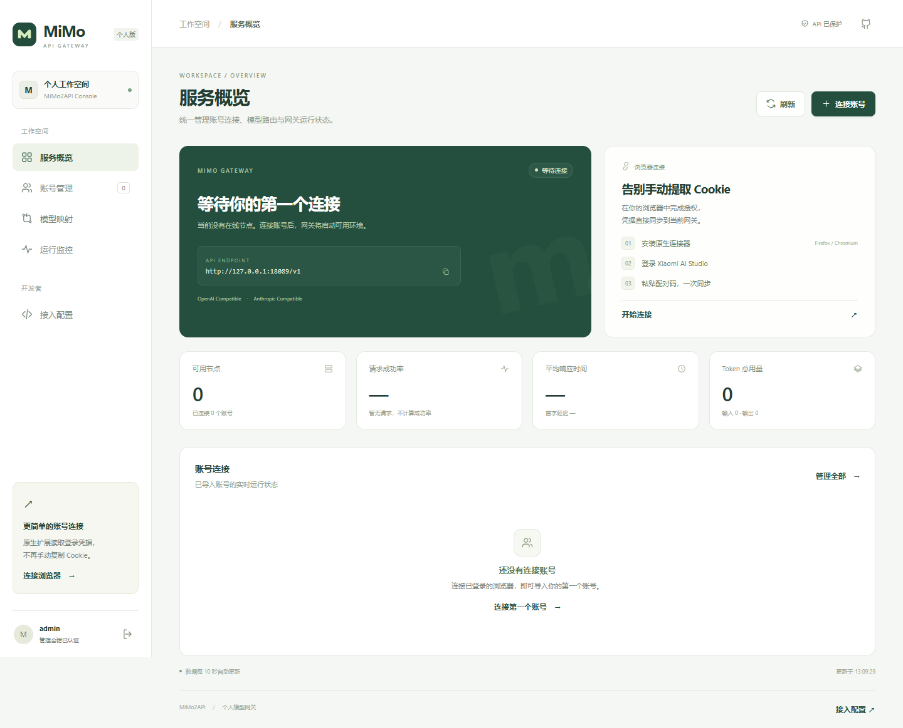

# MiMo2API

个人部署的 MiMo 模型网关，提供 OpenAI / Anthropic 兼容 API，以及中文账号、路由和运行监控控制台。



## 本次更新

- **中文控制台**：侧栏导航、服务概览、账号管理、模型映射、运行监控和接入配置，支持手机布局与键盘操作。
- **原生浏览器连接器**：使用 Cookie API 读取 HttpOnly 登录凭据，支持 Firefox 142+ 和 Chromium。识别当前标签页的 Firefox 容器，不混用其他账号的 Cookie。
- **一次性配对**：控制台生成 5 分钟有效、只能使用一次的配对码；只能导入一个账号，不能用于其他管理操作。扩展不需要管理密码或 API Key。
- **凭据最小化**：扩展不持久保存 Cookie 或配对码；账号列表不再返回 serviceToken、PH 或 sessionKey；远程同步只允许 HTTPS。
- **独立部署**：页面、样式、脚本、图标和扩展全部内嵌二进制；删除第三方字体、图标 CDN 与统计脚本，不依赖运行目录中的网页文件。

## 为什么 Firefox 油猴读取失败？

登录所需的凭据可能设置了 **HttpOnly**。页面的 `document.cookie` 无法读取；油猴管理器的 `GM_cookie` / `GM.cookie` 并不是 Firefox 上可靠可用的能力。安装或更换油猴管理器不能保证解决。

推荐使用本项目的**原生浏览器连接器**，由浏览器授予 Cookie 权限。油猴脚本仅在支持 Cookie API 的环境工作；Firefox 会明确显示原生扩展指引，不再误报“换 Tampermonkey 即可”。

## 编译与运行

要求 **Go 1.26.3+ 和 C 编译器**（SQLite 依赖 CGO）。生产构建不需要 Node.js。

```bash
git clone https://github.com/phaip88/mimo2api.git
cd mimo2api
go build -trimpath -ldflags="-s -w" -o bin/mimo2api ./cmd/mimo2api

# 在当前进程环境生成并注入凭据，不写入源码或配置文件。
export MIMO_API_KEYS="$(openssl rand -hex 32)"
export MIMO_WEBUI_USERNAME=admin
export MIMO_WEBUI_PASSWORD="$(openssl rand -hex 32)"
export MIMO_WEBUI_SECRET_KEY="$(openssl rand -hex 32)"
export SERVER_HOST=127.0.0.1
export SERVER_PORT=8088
export GIN_MODE=release
./bin/mimo2api
```

通过自己的密码管理器或平台密钥服务管理环境变量。访问 [本地控制台](http://127.0.0.1:8088/webui)，使用注入的管理凭据登录。远程部署通过 HTTPS 访问。

## 连接 Xiaomi 账号

1. 控制台点击 **连接账号 → 下载扩展**，解压 ZIP。
2. Firefox 打开 `about:debugging#/runtime/this-firefox`，点击「临时载入附加组件」，选择解压目录里的 `manifest.json`。Chromium 在扩展管理页启用开发者模式，加载已解压目录。
3. 登录 [Xiaomi AI Studio](https://aistudio.xiaomimimo.com/)。Firefox 容器账号需在对应容器标签页操作。
4. 回到控制台生成并复制配对码。在已登录的 AI Studio 标签页打开扩展，粘贴配对码，核对网关地址，点击 **授权并同步账号**。
5. 回到控制台查看账号状态。导入成功代表凭据已保存；节点创建、可用状态由实际运行结果决定。

> 仓库提供未签名开发版扩展。Firefox 临时安装在浏览器重启后失效；长期安装需要 Mozilla 签名，ZIP 不是可直接永久安装的签名 XPI。

扩展只申请 AI Studio 的 Cookie 权限，以及用户确认的网关源地址。它只发送 `userId`、`xiaomichatbot_serviceToken` 和 `xiaomichatbot_ph`，不发送完整 Cookie 集合。配对码以 Authorization 请求头传输，不放入 URL。

### 手动导入与油猴

“连接账号”窗口内展开 **手动导入 / 油猴兼容入口**。支持 Cookie、cURL、Firefox/Chromium 存储表格、JSON 对象及 Cookie JSON 数组。解析在服务端统一完成，保留 Token 尾部的 `=`，不会把表格中的域名、路径等列误当成 Token。

油猴安装地址：`/mimo_sync.user.js`。脚本不内置服务器密码或 API Key，使用相同的一次性配对码。旧版本的 `?key=` / `?api_key=` 密钥注入方式已停止支持。

## 部署完整性与节点状态

控制台可以独立启动，不代表文本模型服务已经可用。原项目的节点生命周期还依赖进程工作目录内的 `bridge/node-metrics-agent-linux-amd64.gif`；该文件不在仓库源码中，也不会通过 `go build` 自动产生。

缺少、无法读取或文件为空时，网关现在停止调度实例，显示具体部署错误，避免反复请求上游和消耗实例创建额度。项目不会自动下载来源不明的桥接程序。

账号的 API 状态与上游实例状态分开：只有对应账号的 MiMo 节点已连接且可调度，才显示“API 可用”。“实例就绪 · 节点未连接”不表示请求可用；额度受限状态会在释放调度槽和服务重启后保留。

## 客户端接入

| 协议      | Base URL                          | 请求端点            |
| --------- | --------------------------------- | ------------------- |
| OpenAI    | `http://127.0.0.1:8088/v1`        | `/chat/completions` |
| Anthropic | `http://127.0.0.1:8088/anthropic` | `/v1/messages`      |

API Key 使用 `MIMO_API_KEYS` 中的值。文本模型：`mimo-v2.5-pro`、`mimo-v2.5`；完整清单以 `GET /v1/models` 为准。其他名称可通过控制台配置映射。

```bash
curl http://127.0.0.1:8088/v1/chat/completions \
  -H "Authorization: Bearer $MIMO_API_KEYS" \
  -H 'Content-Type: application/json' \
  -d '{"model":"mimo-v2.5-pro","messages":[{"role":"user","content":"你好"}]}'
```

## 主要环境变量

| 变量                                          | 说明                              |
| --------------------------------------------- | --------------------------------- |
| `SERVER_HOST` / `SERVER_PORT`                 | 监听地址与端口，默认 0.0.0.0:8000 |
| `MIMO_API_KEYS`                               | API 密钥，多个值用逗号分隔        |
| `MIMO_WEBUI_USERNAME` / `MIMO_WEBUI_PASSWORD` | 控制台登录凭据                    |
| `MIMO_WEBUI_SECRET_KEY`                       | 管理会话签名密钥                  |
| `MIMO_WEBUI_COOKIE_SECURE`                    | HTTPS 部署时设为 true             |
| `MIMO_METRICS_DB_PATH`                        | 指标 SQLite 数据库路径            |
| `MIMO_AISTUDIO_PROXY`                         | 访问 AI Studio 的代理地址         |

账号与统计数据位于进程工作目录的 `users/` 和数据库中，不应提交到版本库。实际配置项以 `internal/config/config.go` 为准。

## 开发与验证

```bash
go test ./...
go build ./cmd/mimo2api
npm ci
npm test
npm run test:extension
npx playwright install chromium
npm run test:browser
```

- Go：Cookie 格式、输入验证、配对鉴权、过期、单次消费、并发重放、资源下载及既有网关测试。
- Node：Cookie 域/路径/分区过滤、容器 ID 传递、权限拒绝、请求参数、错误处理和两种油猴 Cookie API。
- 浏览器：独立本地测试数据下的登录、空状态、配对、导入、映射、手机布局与错误状态，不访问真实账号。
- 原生 Firefox：启动 `geckodriver --allow-system-access --port 18444`，再运行 `node tests/firefox-native.cjs`。使用驱动新建的隔离配置与合成 HttpOnly Cookie，不读取个人浏览器配置。

测试截图输出到 `test-results/`，不纳入版本控制。默认 CI 不使用生产凭据、不部署线上服务。
